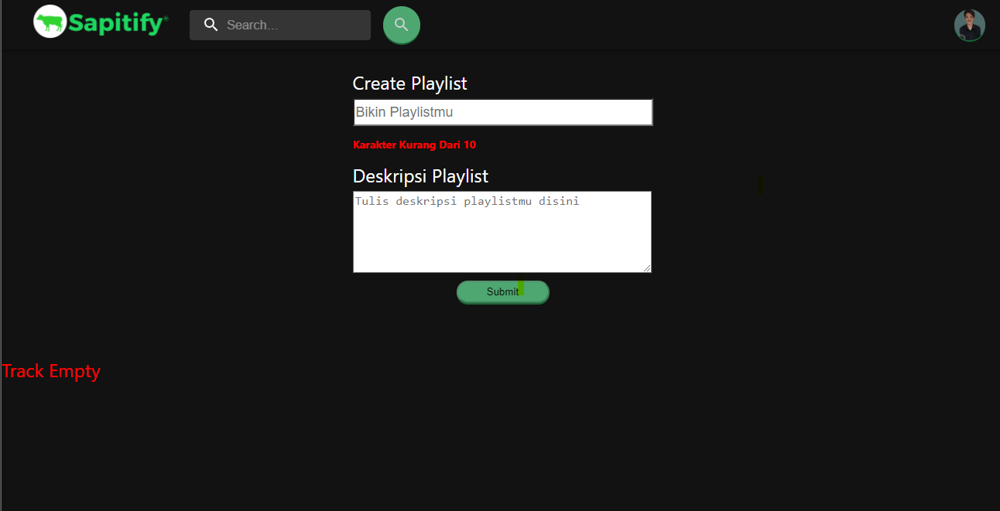
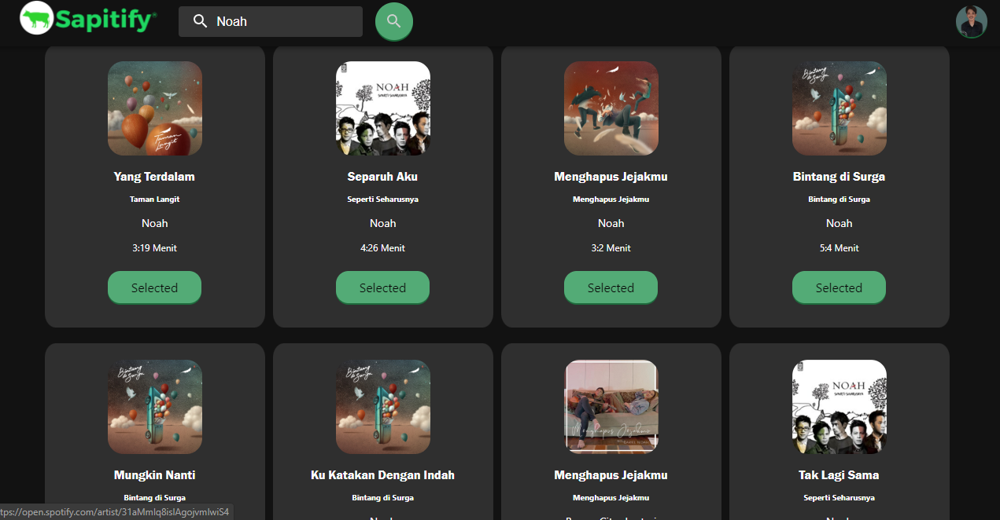

# Sapitify
Sapitify is an application that can let you directly create your Spotify playlist through this application.




## Feature 

- To search for songs🎵
- To create a new playlist 🎶
- To view a user's profile or avatar 🧑👧
- To go to the profile link of the user 
- Logout feature to exit the Sapitify app 🔚
- Responsive Website (PC/Desktop, Tablet, and Smarthphone) 💻📱
- If you haven't searched for a song, it will show the text "Track Empty"


## Powered by

- [Create React App](https://create-react-app.dev/) to initialize the project.
- [React Redux](https://react-redux.js.org/) to manage the app state.
- [Material-ui](https://mui.com/) to add Addbar and Avatar
- Hosted on [Vercel](https://vercel.com/).

## How to run on local

- Clone this project

    ```bash
    git clone https://github.com/tiardwikrisnanto/sapitify-v2.git
    ```

- Go to the project folder

    ```bash
    cd sapitify-v2
    ```

- Install dependencies

    ```bash
    npm install
    ```

- Setup environment variables

    Create file with name `.env.local` and add the following content:

    ```env
    REACT_APP_SPOTIFY_CLIENT_ID = <your spotify client id>
    ```

- Run the server

    ```bash
    npm start
    ```

- Open <http://localhost:3000> with your browser to see the result.


## Don't forget to change the redirect to the login.js file ⚠

    Previous
    ```login.js
        return `https://accounts.spotify.com/authorize?client_id=${clientId}&response_type=token&redirect_uri=https://sapitify-v2.vercel.app&state=${state}&scope=${process.env.REACT_APP_SPOTIFY_SCOPE}`;
    ```
    After
    ```login.js
        return `https://accounts.spotify.com/authorize?client_id=${clientId}&response_type=token&redirect_uri= http://localhost:3000&state=${state}&scope=${process.env.REACT_APP_SPOTIFY_SCOPE}`;
    ```
